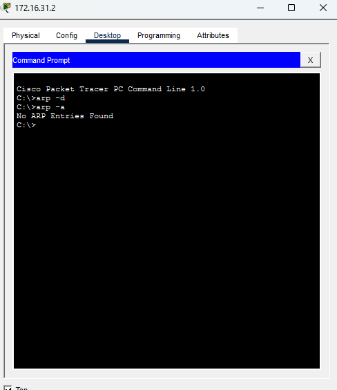
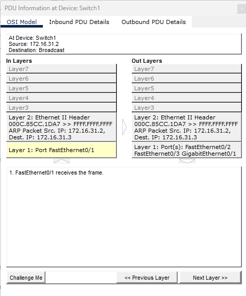
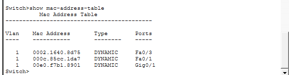
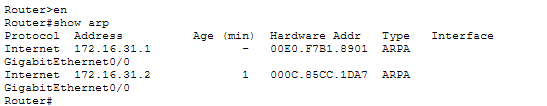

# Análisis de Tráfico de Red: Inspección del Protocolo ARP con Cisco Packet Tracer

## 📝 Descripción del Proyecto
En este laboratorio se realizó una auditoría táctica de tráfico en una infraestructura de red local (LAN) utilizando el Modo Simulación de Cisco Packet Tracer. El objetivo principal fue interceptar, mapear y documentar el comportamiento del protocolo ARP (Address Resolution Protocol) y verificar cómo los switches y routers construyen sus tablas de direccionamiento dinámico para coordinar la comunicación entre capas.

---

## 🛠️ Tecnologías y Conceptos Aplicados
* **Análisis de Paquetes:** Intercepción e inspección detallada de PDUs de Capa 2 y Capa 3.
* **Protocolo ARP:** Ciclo de vida de solicitudes de difusión (Broadcast) y respuestas (Unicast).
* **Direccionamiento Físico:** Asociación dinámica de direcciones IP con direcciones MAC.
* **Conmutación (Switching):** Mapeo de puertos físicos mediante la tabla de asignación MAC.
* **Enrutamiento (Routing):** Gestión de tablas ARP en interfaces de Gateway para saltos remotos.

---

## 🚀 Paso a Paso e Identificación de Evidencias

### 🏁 1. Auditoría Inicial (Limpieza de la Caché ARP)
Para iniciar el análisis desde un estado controlado, se ingresó al Command Prompt de la PC administrativa (`172.16.31.2`) y se purgó la memoria caché para forzar al dispositivo a realizar un proceso de descubrimiento de identidades desde cero.

#### Evidencia 1 - Tabla ARP completamente vacía:


---

### 🔍 2. Intercepción del Paquete de Broadcast (Difusión)
Al ejecutar un comando de diagnóstico hacia un host vecino, se interceptó la PDU generada en el Switch. La inspección de los campos de la Capa 2 (Layer 2) confirmó que, al desconocer el destino físico, el dispositivo emite una trama con dirección MAC de destino global (`FFFF.FFFF.FFFF`) para inundar la red local.

#### Evidencia 2 - Detalle del encabezado Ethernet II en Broadcast:


---

### 📊 3. Mapeo Dinámico y Resolución en el Host
Una vez que el tráfico completó su ciclo de retorno en tiempo real, se volvió a auditar la tabla interna de la PC. El sistema procesó la respuesta e indexó de forma dinámica la dirección IP vinculándola de manera persistente a la dirección física real del equipo destino.

#### Evidencia 3 - Entrada ARP registrada dinámicamente:


---

### 🎛️ 4. Auditoría del Conmutador (Tabla de MACs del Switch)
Se accedió a la interfaz de línea de comandos (CLI) del Switch perimetral para verificar su tabla de conmutación. Se constató que el equipo aprendió y catalogó de forma autónoma qué dirección física exacta se encuentra transmitiendo detrás de cada puerto o interfaz de red activa.

#### Evidencia 4 - Mapeo de interfaces físicas en el Switch:


---

### 🌐 5. Resolución en Comunicaciones Remotas (Tabla ARP del Router)
Finalmente, para validar cómo se comporta el tráfico cuando cruza hacia otros segmentos de la red, se auditó el almacenamiento del Router core. El comando de diagnóstico reflejó las relaciones de IP/MAC del gateway junto con el tiempo de vida (Age) de las solicitudes resueltas en sus interfaces lógicas.

#### Evidencia 5 - Inspección de la tabla ARP del Router perimetral:


---

## 💻 Comandos de Auditoría Aplicados

Resumen de los comandos ejecutados en las diferentes terminales de la infraestructura para recolectar las evidencias de tráfico:

```text
! ==========================================
! COMANDOS EJECUTADOS EN LA TERMINAL DE LA PC
! ==========================================

! 1. Eliminar la tabla ARP actual (Limpieza de caché)
C:\> arp -d

! 2. Visualizar la tabla ARP guardada en memoria
C:\> arp -a


! ==========================================
! COMANDOS DE DIAGNÓSTICO EN EL SWITCH
! ==========================================

! 1. Visualizar la tabla de direcciones MAC aprendidas
Switch> show mac-address-table


! ==========================================
! COMANDOS DE DIAGNÓSTICO EN EL ROUTER
! ==========================================

! 1. Entrar al modo EXEC Privilegiado
Router> enable

! 2. Desplegar la tabla ARP global del dispositivo
Router# show arp
